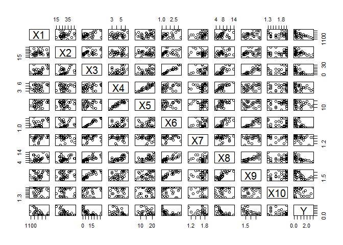

Project 1 on linear regression
================

This is my first project on linerar regression.

Title - Linear regression
=========================

second title - Introduction
---------------------------

First I will reuse the content from my school project then I will build on top of it.

``` r
2+2
```

    ## [1] 4

First I will load the data file for building the model

``` r
remove(chenille)
```

    ## Warning in remove(chenille): object 'chenille' not found

``` r
caterpillar=read.table(file="caterpillar.txt",header=T,dec=".")
plot(caterpillar)
```



``` r
cor(caterpillar)
```

    ##              X1          X2         X3          X4          X5         X6
    ## X1   1.00000000  0.08609045  0.5271790  0.32107621  0.28760012  0.5028995
    ## X2   0.08609045  1.00000000  0.2991981  0.13455698  0.11752655  0.2748071
    ## X3   0.52717902  0.29919810  1.0000000  0.41514099  0.29825030  0.9791548
    ## X4   0.32107621  0.13455698  0.4151410  1.00000000  0.90500923  0.4406882
    ## X5   0.28760012  0.11752655  0.2982503  0.90500923  1.00000000  0.3101831
    ## X6   0.50289949  0.27480715  0.9791548  0.44068816  0.31018308  1.0000000
    ## X7   0.28090733 -0.14326724  0.1379197  0.05962807 -0.07894660  0.1612239
    ## X8   0.34831973  0.24175541  0.7550176  0.77464245  0.60073266  0.8071709
    ## X9   0.32709066  0.24913225  0.8650520  0.43563032  0.24170040  0.9020443
    ## X10 -0.11815365  0.10771014  0.1944209 -0.04834246 -0.02449297  0.1162211
    ## Y   -0.53365132 -0.46474386 -0.5668793 -0.35757227 -0.15784777 -0.5739685
    ##              X7          X8          X9         X10          Y
    ## X1   0.28090733  0.34831973  0.32709066 -0.11815365 -0.5336513
    ## X2  -0.14326724  0.24175541  0.24913225  0.10771014 -0.4647439
    ## X3   0.13791973  0.75501756  0.86505200  0.19442085 -0.5668793
    ## X4   0.05962807  0.77464245  0.43563032 -0.04834246 -0.3575723
    ## X5  -0.07894660  0.60073266  0.24170040 -0.02449297 -0.1578478
    ## X6   0.16122391  0.80717087  0.90204434  0.11622113 -0.5739685
    ## X7   1.00000000  0.06716936  0.08141062  0.14494638 -0.2132395
    ## X8   0.06716936  1.00000000  0.83051652  0.04168443 -0.5527614
    ## X9   0.08141062  0.83051652  1.00000000  0.14902983 -0.5837295
    ## X10  0.14494638  0.04168443  0.14902983  1.00000000 -0.1224345
    ## Y   -0.21323946 -0.55276138 -0.58372946 -0.12243448  1.0000000

here sould learn: - what is correlation - what is correlation between multiple variables

This is an [R Markdown](http://rmarkdown.rstudio.com) Notebook. When you execute code within the notebook, the results appear beneath the code.

``` r
#here we build a data model lm -- linear model
reslm <- lm(Y~X1+ X2 + X3 + X4 + X5 + X6 + X7 + X8 + X9 + X10 ,caterpillar)
library(car)
round(vif(reslm),2)
```

    ##    X1    X2    X3    X4    X5    X6    X7    X8    X9   X10 
    ##  1.93  1.16 42.81 16.32  9.65 61.49  1.69 13.15  9.59  1.67

Try executing this chunk by clicking the *Run* button within the chunk or by placing your cursor inside it and pressing *Ctrl+Shift+Enter*.

``` r
plot(cars)
```


Add a new chunk by clicking the *Insert Chunk* button on the toolbar or by pressing *Ctrl+Alt+I*.

When you save the notebook, an HTML file containing the code and output will be saved alongside it (click the *Preview* button or press *Ctrl+Shift+K* to preview the HTML file).
